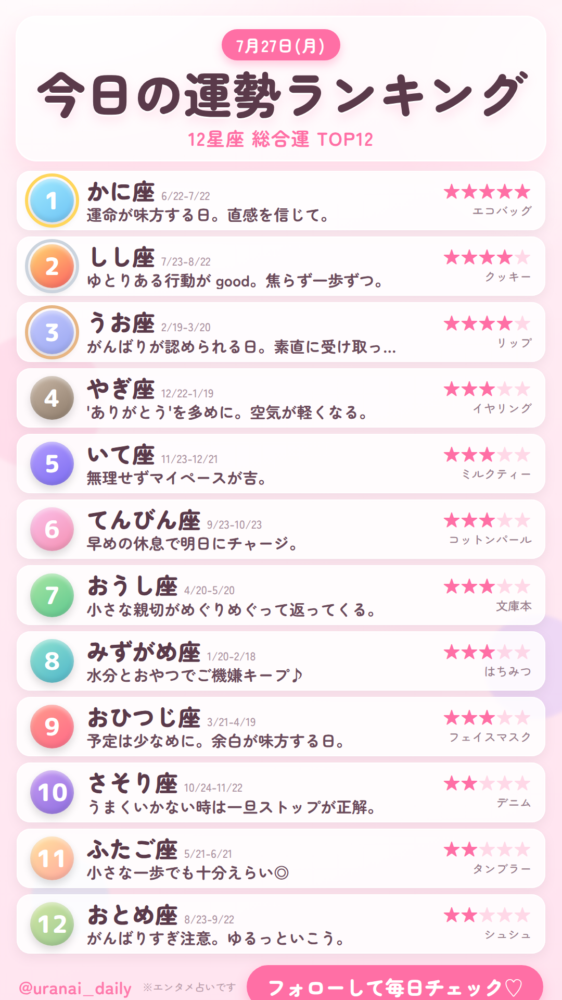
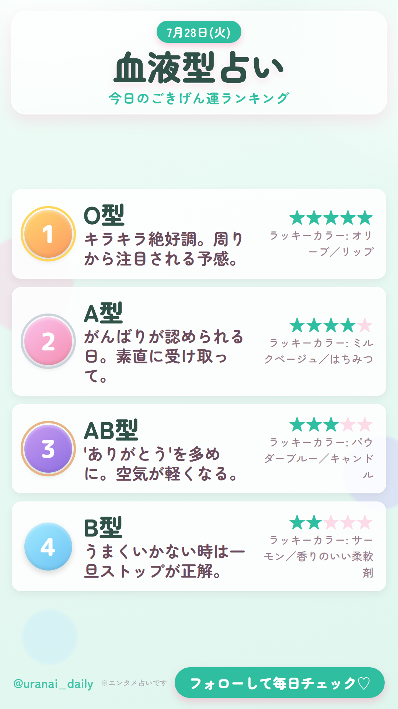
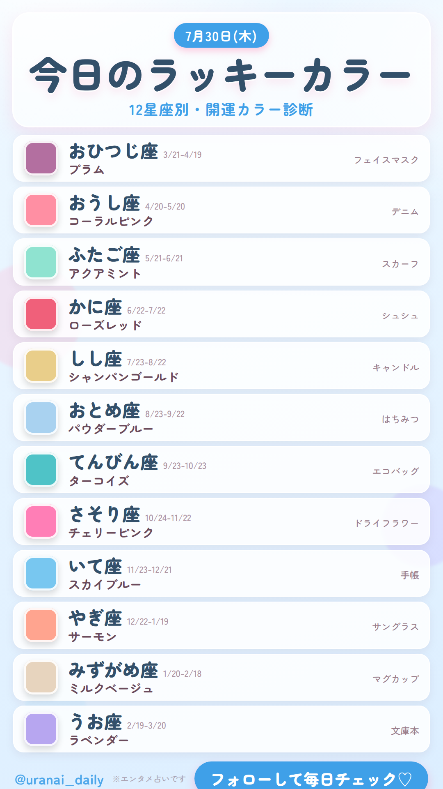

# uranai-daily ｜ TikTok占い動画 量産キット

「占いランキング表＋BGM」の縦型動画（1080×1920）を、**日付を指定するだけで日替わりに自動生成**するための一式です。
星座占い・血液型占い・ラッキーカラーなどを曜日ごとにローテーションし、可愛いパステルデザインで書き出します。

<p>
  
  
  
</p>

> ⚠️ 収益（再生数マネタイズ）の現実と、静止画コンテンツならではの注意点を必ず先に読んでください → **[docs/strategy.md](docs/strategy.md)**
> 量産の具体フロー → **[docs/workflow.md](docs/workflow.md)**

---

## これは何をするか

1. **コンテンツ生成** … 日付から「その日の占いデータ」を決定論的に生成（同じ日なら毎回同じ結果）。
2. **画像レンダリング** … HTMLテンプレート（可愛いデザイン）を Chromium で 1080×1920 のPNGに。
3. **動画化** … 静止画＋BGMを ffmpeg で縦型MP4に。BGM無しなら無音動画（テスト用）。
4. **キャプション生成** … ハッシュタグ入りの投稿文を `caption.txt` として同時出力。

日替わりローテーション（初期設定・`fortune/schedule.py` で変更可）:

| 曜 | テーマ | 内容 |
|---|---|---|
| 月 | `zodiac_overall` | 12星座 総合運ランキング |
| 火 | `blood_overall` | 血液型 今日のごきげん運 |
| 水 | `zodiac_love` | 12星座 恋愛運ランキング |
| 木 | `lucky_color` | 12星座 ラッキーカラー診断 |
| 金 | `zodiac_money` | 12星座 金運ランキング |
| 土 | `blood_compat` | 血液型 相性ランキング |
| 日 | `zodiac_weekly` | 今週の運勢まとめ |

---

## クイックスタート

前提ツール（この開発環境には導入済み）:
- `ffmpeg`
- Node.js ＋ `playwright`（Chromium）
- Python 3（追加パッケージ不要・標準ライブラリのみ）

```bash
# 今日1日分（画像＋無音動画＋キャプション）
python scripts/make.py

# 8/1 から30日分をまとめて生成（BGM付き）
python scripts/make.py --date 2026-08-01 --days 30 --bgm assets/bgm/loop.mp3

# 内容の事前チェックだけしたい（画像とキャプションのみ・動画は作らない）
python scripts/make.py --date 2026-08-01 --days 30 --no-video

# 半年分の投稿スケジュール表を書き出す
python scripts/export_schedule.py --date 2026-08-01 --days 182
```

出力は `output/<日付>_<テーマ>/` に:
```
frame.png     完成画像（サムネにも使える）
video.mp4     投稿用動画
caption.txt   投稿文（ハッシュタグ入り・コピペ用）
data.json     生成データ（内容確認・手直し用）
```

---

## カスタマイズ

| やりたいこと | 触る場所 |
|---|---|
| アカウント名・CTA文言 | `fortune/generator.py` の `HANDLE` / `CTA` |
| 曜日ローテーション | `fortune/schedule.py` の `WEEKLY_ROTATION` |
| 占いメッセージ・ラッキー要素の文言 | `fortune/data.py` |
| 配色（パステルの雰囲気） | `fortune/data.py` の `PALETTES` |
| デザイン（レイアウト・フォント） | `templates/ranking.html` |
| ハッシュタグ | `fortune/generator.py` の `_BASE_HASHTAGS` |

---

## 構成

```
fortune/            コンテンツ生成（Python・依存なし）
  data.py             星座/血液型/カラー/メッセージ辞書
  schedule.py         曜日ローテーションと日付ユーティリティ
  generator.py        日付 -> 1投稿分のデータ(dict)
templates/
  ranking.html        可愛いランキング表テンプレート（データ駆動）
scripts/
  make.py             司令塔（生成→レンダリング→動画化）
  render.mjs          HTML+データ -> PNG（Playwright）
  build_video.sh      PNG+BGM -> MP4（ffmpeg）
  export_schedule.py  スケジュールをCSV/Markdownで出力
assets/
  fonts/              ローカル化した丸ゴシックフォント（Zen Maru Gothic / M PLUS Rounded 1c）
  bgm/                BGMを置く場所（利用条件は docs/workflow.md 参照）
docs/
  strategy.md         収益化の現実と伸ばし方（最初に読む）
  workflow.md         量産の具体フロー
  schedule.csv        自動生成される投稿スケジュール
samples/              サンプル出力（各テーマ1枚ずつ）
```

## フォントについて

デザインには Google Fonts の **Zen Maru Gothic** と **M PLUS Rounded 1c**（ともに SIL Open Font License）を、
表示に必要なサブセットをローカル化して `assets/fonts/` に同梱しています。再取得は `python scripts/fetch_fonts.py`。
